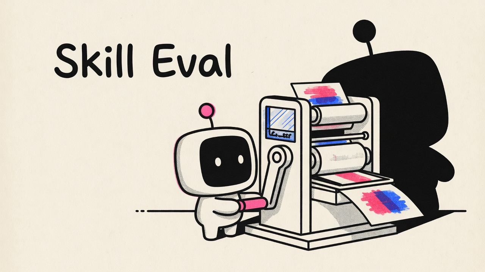
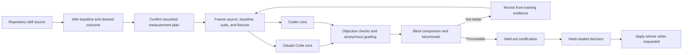

<div align="center">



### Prove that an agent skill got better.

**Benchmark the skill you are editing, improve it with independent model judgment, and promote only the revision that earns it.**

[](https://github.com/tmchow/skill-eval/actions/workflows/ci.yml)
[](LICENSE)


`baseline` -> `realistic evals` -> `blind cross-model judgment` -> `verified improvement`

</div>

> Do not merge a skill change because it feels better. Ship it because it won under realistic use, held its regressions, and survived independent judgment.

## The Promise

Skill changes are deceptively hard to evaluate. A tighter instruction may improve the happy path while breaking an adjacent intent. A new orchestration step may fire correctly without improving the final output. The skill installed in your harness may not even be the source you meant to test.

Skill Eval turns that uncertainty into an evidence-backed development loop:

1. **Understand the change.** It reads the repository version, reconstructs the intended user benefit, and chooses the right baseline for a new skill, local edit, branch, or PR.
2. **Design the right eval.** It tests the smallest scope that can prove the outcome, then adds regression coverage around it.
3. **Run a fair comparison.** Baseline and current source execute in isolated, realistic environments without installing the skill under test.
4. **Ask independent judges.** Claude Code and Codex can execute and grade the cases; blind judges compare anonymous outputs without version labels.
5. **Improve what failed.** When requested, it revises behavior or triggering, retests held-out cases, and keeps only meaningful gains.
6. **Promote with proof.** The winning revision is hash-sealed, revalidated, and applied only when the evidence still matches.

| What you need | What Skill Eval delivers |
|---|---|
| **A real baseline** | No-skill, `HEAD`, explicit Git ref, or branch/PR merge-base selected from the actual development state |
| **Outcome-focused evals** | Quality comparisons for user value, deterministic checks for mechanisms, and both when the change needs both |
| **Cross-model confidence** | Claude Code and Codex results kept separate so disagreement and convergence remain visible |
| **Regression protection** | Training and held-out cases, adjacent-intent trigger checks, critical gates, and repeated runs when variance requires them |
| **Automatic improvement** | Up to five evidence-driven challengers, with the active harness's `skill-creator` guidance used when available |
| **Long-run durability** | Resumable calls, explicit limits, progress status, and reasoning checkpoints that survive context compaction |
| **Safe promotion** | Immutable evidence, sealed decisions, target backups, conservative commit policy, and no automatic push |

## Install

### Claude Code

```bash
claude plugin marketplace add tmchow/skill-eval
claude plugin install skill-eval@skill-eval
```

Restart Claude Code after installation.

### Codex

```bash
codex plugin marketplace add tmchow/skill-eval
codex plugin add skill-eval@skill-eval
```

Start a new Codex thread after installation.

### Requirements

- macOS, Linux, or WSL
- [Bun](https://bun.sh/) 1.2+
- Git
- An authenticated Claude Code or Codex CLI

Both model hosts are recommended. One authenticated host is enough to run, with the missing cross-model coverage called out explicitly.

## Your First Eval

Open the repository containing the skill you are developing and ask for the outcome you care about.

**Claude Code**

```text
/skill-eval:skill-eval Evaluate the skill changes on this branch.
Improve them if the eval finds a real regression, but promote only a measured improvement.
```

**Codex**

```text
$skill-eval Evaluate the skill changes on this branch.
Improve them if the eval finds a real regression, but promote only a measured improvement.
```

Before spending model calls, Skill Eval gives you a short confirmation like this:

```text
What I am evaluating: the branch version against its merge-base with main.

Primary claim: the revised review skill produces more useful final reviews,
not merely that its new cross-model step launches.

Regression coverage: routine reviews remain concise and do not invoke the
expensive path unnecessarily.

First pass: two paired scenarios on Claude, with Codex as the blind peer judge.
Four direct behavior runs; nested work remains unknown until calibration.

Start the first pass?
```

The workflow continues automatically after confirmation. Between passes, it reports only what changed, the consequential model signal, and the next adjustment.

## Ask for the Eval You Need

| Goal | Example prompt | Evidence selected |
|---|---|---|
| **Check a local edit** | `Compare this skill against HEAD.` | Current source vs frozen `HEAD` |
| **Evaluate a PR** | `Evaluate the skill changes in this PR.` | Current branch vs merge-base |
| **Test a new skill** | `Evaluate this new uncommitted skill.` | Current source vs normal no-skill behavior |
| **Test triggering only** | `Only test whether the new description triggers correctly.` | Positive and adjacent-negative discovery prompts; no full behavior run |
| **Measure output quality** | `Did this revision make the generated plans more useful?` | Paired anonymous outputs plus blind preference judges |
| **Verify orchestration** | `Confirm the peer reviewer runs only for high-risk documents.` | Structured tool-call and side-effect assertions |
| **Optimize automatically** | `Improve this skill and keep the change only if it wins.` | Training-guided revisions plus held-out certification |
| **Evaluate without editing** | `Evaluate this branch, but do not revise or promote anything.` | Evidence report only |

Explicit scope wins. If you say `only`, name exact hosts, set a model-call ceiling, or prohibit promotion, the workflow treats that as a hard boundary.

## What Makes the Evidence Trustworthy

### It tests source, not whatever happens to be installed

The target is resolved to an exact repository path. Baseline and current versions are copied into frozen snapshots, and executors receive only those snapshots. A same-name installed skill cannot silently contaminate the run.

### It measures the benefit, not the easiest proxy

Skill Eval traces a changed mechanism through its consumed output to the terminal benefit. If a cross-model reviewer launches but the final review does not improve, the primary quality claim fails. Mechanism checks remain useful supporting evidence; they do not get promoted into a success verdict merely because they are easy to inspect.

### It matches evidence to the claim

| Claim | Evidence |
|---|---|
| A file, command, schema, or tool call is correct | Deterministic assertion |
| An output satisfies a qualitative requirement | Anonymous transcript grader |
| One revision produces better work | Blind A/B preference |
| Triggering is precise and complete | Positive and adjacent-negative discovery trials |
| The improvement generalizes | Held-out cases hidden from the reviser |
| The result is portable | Host-specific Claude Code and Codex results |

Critical deterministic failures short-circuit expensive qualitative calls. Blind preferences cannot override an objective regression. Executor self-reports are never accepted as proof.

### It shows cross-model disagreement instead of averaging it away

The point of a second model family is not another green checkmark. Skill Eval records which host executed, graded, or judged each case. When Claude and Codex disagree, the pass summary names the disputed behavior and its practical implication. When a later revision produces convergence, that is reported as evidence rather than hidden inside an aggregate score.

### It survives long evaluations

Every completed behavior and trigger call is persisted immediately. Long operations expose status without spending another model call, enforce optional call/time ceilings, and stop sending work to a host after repeated timeouts.

Related runs belong to one evaluation campaign:

```text
measurement goal
  |
  +-- calibration run
  +-- optimization run(s)
  +-- certification run
  +-- confirmation run
  |
  +-- agent-authored reasoning checkpoints
```

The deterministic engine indexes facts. The agent writes the reasoning checkpoints and final report. After context compaction, it can reconstruct the campaign, verify material claims against raw artifacts, and continue without pretending generated prose is objective evidence.

## How It Works



The adaptive work stays with the agent: understanding the change, designing realistic environments, interpreting disagreement, and deciding the next revision. The engine owns reproducibility: snapshots, execution, assertions, identities, hashes, resume state, and promotion guards.

## How It Compares

| Approach | Best for | What remains manual or missing |
|---|---|---|
| **Skill Eval** | Cross-model benchmarking, iterative autofix, regression protection, and evidence-backed promotion from either Claude Code or Codex | Requires authenticated local model CLIs and can consume meaningful model time for broad quality claims |
| **Claude Code `skill-creator` evals** | Creating and refining skills inside Claude Code with Anthropic's native workflow | Skill Eval adds a portable Claude/Codex entrypoint, explicit cross-model evidence, multi-run campaigns, and sealed promotion |
| **Deterministic tests** | Parsers, scripts, schemas, and exact side effects | Cannot by themselves establish whether an open-ended document, review, or plan became more useful |
| **Manual prompt testing** | Fast intuition and exploratory spot checks | Easy to change the prompt, environment, baseline, or judgment standard between runs; no durable promotion boundary |

Skill Eval complements deterministic tests and skill-authoring tools. It is the layer that asks: **did this particular revision produce a measured improvement under realistic use?**

## Promotion Is Deliberately Conservative

Promotion happens only when requested and only from a sealed certification decision.

- Intermediate challengers are never committed.
- Training gains must survive held-out behavior and trigger checks.
- Suite, fixture, benchmark, version, and target hashes are revalidated at the promotion boundary.
- Post-run edits block promotion instead of being overwritten.
- Dirty repositories, untracked targets, protected/default branches, and policy-restricted projects remain uncommitted.
- A clean tracked target on an allowed feature branch may receive one final commit.
- Skill Eval never pushes.

## Evidence and Privacy

Run artifacts live outside the target repository:

```text
/tmp/skill-eval/<skill-name>/<run-id>/
/tmp/skill-eval/<skill-name>/campaigns/<campaign-id>/
```

Artifacts include frozen source and fixture hashes, effective host arguments, redacted event streams, outputs, grades, anonymous judgments, trigger results, benchmarks, reasoning checkpoints, sealed decisions, and promotion backups.

Recognized credential formats and values from secret-bearing environment variables are redacted before event, stderr, or final-output artifacts are persisted. Generated evals are never placed inside the distributed target skill. Reusable calibrated suites are written only when useful, under:

```text
<target-repository>/.skill-eval/<skill-name>/
```

## Human Review, Only When It Adds Value

Most comparisons are resolved by objective checks and independent blind judges. If a genuinely subjective disagreement remains, or you ask to inspect the evidence, Skill Eval serves a read-only anonymous review page on localhost. You answer through the active harness's native interaction tool; there is no download-and-find-a-JSON workflow.

Human feedback adjudicates that specific anonymous comparison. It cannot waive objective gates or rewrite held-out evidence.

## Troubleshooting

### The target skill name cannot be resolved

Pass the repository path explicitly:

```text
$skill-eval Evaluate /absolute/path/to/repo/skills/my-skill against this branch's merge-base.
```

Bare names resolve from the current repository's conventional `skills/` directory and exact frontmatter names. Ambiguous names require a path.

### Claude Code or Codex is unavailable

Authenticate the missing CLI, then start a fresh harness session. One ready host can still evaluate, but the report will identify the missing cross-model coverage.

```bash
claude --version
codex --version
```

### The comparison has no delta

The selected baseline and current source are byte-identical. Ask for the intended comparison explicitly, such as the PR merge-base, an exact Git ref, or `HEAD` for uncommitted edits.

### A long run timed out

A timeout is inconclusive, not a regression. Skill Eval preserves completed calls and resumes only missing work. If the target launches nested agents or scripts, its known inner timeout must fit inside the executor ceiling.

### The wrong installed skill seems to be running

Behavior executors are isolated from installed same-name copies. Confirm that the reported target path points to the repository source you intended. Do not invoke the installed target skill separately during the eval and treat that output as campaign evidence.

### Bun is too old

Upgrade to Bun 1.2 or newer and rerun preflight:

```bash
bun --version
```

## Limitations

- **Developer tool, not a skill generator.** Skill creation, packaging, and marketplace publishing remain separate concerns.
- **One primary skill per campaign.** Cross-skill behavior can be represented in fixtures, but promotion targets one skill directory.
- **Quality evidence costs model time.** Trigger-only and deterministic checks are cheap; broad end-to-end quality comparisons are not. Calibration comes first, and explicit call/time ceilings are supported.
- **Cross-model coverage depends on local access.** A missing or unauthenticated secondary host degrades the conclusion rather than blocking all evaluation.
- **Native Windows is not currently targeted.** Supported environments are macOS, Linux, and WSL.
- **No universal score can replace judgment.** Benchmarks quantify what the suite measured; they do not prove qualities the suite never exercised.

## FAQ

### Can it evaluate a brand-new, uncommitted skill?

Yes. When the skill does not exist at the selected baseline, Skill Eval compares it with normal no-skill host behavior.

### Can it evaluate committed changes on a feature branch or PR?

Yes. It resolves the base branch and uses the branch/PR merge-base unless you request another ref.

### What if the same skill is already installed?

The repository source remains authoritative. Frozen executor snapshots exclude same-name installed skill content from the behavior and trigger runs.

### Does it always run the full skill end to end?

No. It selects the narrowest evidence that preserves the causal link to the claimed outcome. A trigger-only request skips behavior execution; an inspectable script contract can skip model calls; an output-quality claim still requires real paired outputs.

### Does it always use both Claude Code and Codex?

It uses every confirmed ready host that the run requires. If only one is available, evaluation can continue with a clearly limited cross-model conclusion.

### Will it edit my skill automatically?

Only when you ask for improvement. Evaluation-only requests stop after the evidence report. Promotion is a separate, explicit boundary.

### Will it commit or push changes?

It may create one final commit only when requested promotion succeeds and repository policy permits it. It never pushes.

### Why not save every generated eval with the skill?

Most generated cases are campaign evidence, not product source. Runs stay in OS temp. Only a calibrated suite with durable reuse value is persisted under the target repository's `.skill-eval/` directory.

## Development

```bash
git clone https://github.com/tmchow/skill-eval.git
cd skill-eval
bun install
bun run validate
```

The normal suite uses fake host executables and makes no model calls. Run authenticated live smoke coverage explicitly:

```bash
SKILL_EVAL_LIVE=1 bun test tests/live-smoke.test.ts
```

## About Contributions

Bug reports and pull requests are welcome, but acceptance will be selective. Changes need to fit the project's direction, preserve its trust boundaries, and justify the maintenance cost they introduce.

AI-assisted contributions should use a strong reasoning model appropriate to the work, such as Fable, Opus, GPT-5.6 Sol, or a comparably capable model. Before opening a PR, review the complete diff critically, run the relevant test suite, exercise important failure paths, and resolve the findings you would raise in a serious code review. Generated code that has only been prompted into existence, without careful human or agent verification, is not ready for review here.

Please include the problem being solved, the evidence that the change works, the validation performed, and any important limitations or unresolved risks. Focused bug reproductions are especially valuable, even when you do not have a proposed fix.

Submitting a contribution does not create an expectation that it will be merged. I may decline sound work because it does not match the direction, scope, or maintenance model of the project. No hard feelings either way.

Read [CONTRIBUTING.md](CONTRIBUTING.md) for the development workflow, validation requirements, AI-assistance disclosure, and pull request standard.

## Attribution

Skill Eval is a clean-room implementation inspired by the evaluation methodology in Anthropic's Claude Code `skill-creator`, including paired baselines, inspectable artifacts, quantitative grading, and trigger-description evaluation. See [NOTICE](NOTICE).

## License

[MIT](LICENSE) (c) 2026 Trevin Chow
