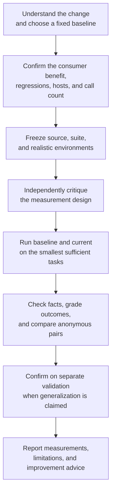

<div align="center">


### Measure whether an agent skill actually got better.

**Run realistic cross-model evals, diagnose what failed, and get evidence-backed advice without installing or mutating the skill under test.**

[](https://github.com/tmchow/skill-eval/actions/workflows/ci.yml)
[](LICENSE)


`fixed baseline` -> `realistic tasks` -> `blind cross-model judgment` -> `actionable diagnosis`

</div>

> A skill should not win because its new mechanism ran. It should win because users got a better result without material regressions.

## The Promise

Skill changes are deceptively hard to evaluate. A tighter instruction can improve one prompt while breaking an adjacent intent. A new orchestration step can fire correctly without improving the final document. A same-name installed skill can silently contaminate a repository-source test.

Skill Eval turns that uncertainty into a reproducible evaluation:

1. **Understand the actual change.** It reconstructs the intended consumer benefit from source, behavior, and context rather than trusting one PR description.
2. **Choose the right counterfactual.** Existing skills compare with a selected Git snapshot; new skills must earn their keep against normal no-skill behavior.
3. **Design the smallest sufficient eval.** It selects enough distinct, realistic scenarios to cover the intended improvement and material regression boundaries. Trigger checks, deterministic contracts, paired quality tasks, and downstream consumers are used only where they answer the hypothesis.
4. **Run source without installing it.** Baseline and current snapshots execute in controlled environments, isolated from same-name installed copies.
5. **Judge independently.** Claude Code and Codex can execute, grade, and blindly compare anonymous outputs while disagreements remain visible.
6. **Diagnose without moving the goalposts.** A durable evidence index and reasoning checkpoints survive long runs and context compaction.
7. **Return advice, not edits.** Skill Eval explains what evidence supports, what failed, and which skill layer likely owns the problem. Your authoring workflow makes changes and invokes the eval again.

| What you need | What Skill Eval delivers |
|---|---|
| **A real baseline** | No-skill, `HEAD`, explicit Git ref, or branch/PR merge-base selected from the development state |
| **Outcome-focused evidence** | Outcome expectations decide effectiveness; mechanism checks can gate but cannot manufacture a win |
| **Cross-model confidence** | Host, model, role, and effort stay explicit so agreement and disagreement are interpretable |
| **Regression protection** | Prior campaign cases cannot silently disappear; invalid retirement requires evidence |
| **Long-run durability** | Resumable attempts, factual evidence indexes, and agent reasoning checkpoints |
| **Actionable diagnosis** | Evidence-linked advice that may call for prose, references, scripts, or structural redesign |
| **A clean ownership boundary** | The evaluator never edits, commits, promotes, or pushes the target skill |

## Install

### Claude Code

```bash
claude plugin marketplace add tmchow/skill-eval
claude plugin install skill-eval@skill-eval
```

Restart Claude Code after installation.

### Codex

```bash
codex plugin marketplace add tmchow/skill-eval
codex plugin add skill-eval@skill-eval
```

Start a new Codex thread after installation.

### Requirements

- macOS, Linux, or WSL
- [Bun](https://bun.sh/) 1.2+
- Git
- An authenticated Claude Code or Codex CLI

One authenticated host can run a limited eval. When both are ready, Skill Eval calibrates on the invoking host and normally repeats the same frozen evidence on the other host.

## Your First Eval

Open the repository containing the skill under development.

**Claude Code**

```text
/skill-eval:skill-eval Test whether the skill changes on this branch are beneficial.
```

**Codex**

```text
$skill-eval Test whether the skill changes on this branch are beneficial.
```

Before spending model calls, Skill Eval gives you a short proposal:

```text
What I am evaluating: the branch version against its merge-base with main.

Primary claim: the new cross-model review produces a materially more useful
final review, not merely an extra peer call.

Coverage: one paired quality task, one restraint scenario, and focused checks
that the required peer completed. Claude calibrates first; valid evidence then
runs on Codex. The first pass is four direct behavior calls plus blind judges;
confirmed second-host coverage adds four Codex behavior calls. Nested work is unknown.

This run will evaluate and advise. It will not edit the skill.

Start the first pass?
```

## Ask For The Eval You Need

| Goal | Example prompt | Evidence selected |
|---|---|---|
| **Check a local edit** | `Compare this skill against HEAD.` | Current source vs frozen `HEAD` |
| **Evaluate a PR** | `Evaluate the skill changes in this PR.` | Current branch vs merge-base |
| **Test a new skill** | `Evaluate this new uncommitted skill.` | Current source vs normal no-skill behavior |
| **Test triggering only** | `Only test whether this description triggers correctly.` | Positive and adjacent-negative discovery prompts |
| **Measure output quality** | `Did this revision make generated plans more useful?` | Paired anonymous outputs plus blind judges |
| **Verify a contract** | `Confirm the peer reviewer runs only for high-risk documents.` | Structured tool and side-effect checks |
| **Test generalization** | `Check whether the improvement holds across both hosts and related tasks.` | Training calibration plus separate validation evidence |

Explicit scope wins. `Only`, exact hosts, comparison refs, and model-call ceilings are hard boundaries. If a requested scope cannot support the requested conclusion, Skill Eval says so before execution.

## Why The Evidence Is Credible

### Source, not the installed copy

The target resolves to an exact repository path. Executors receive frozen baseline/current snapshots by path and are forbidden from invoking a same-name installed skill. This works for uncommitted files, fully pushed branches, and everything between.

### Benefit, not proxy

Every expectation has an evidence role:

- **Outcome** evidence directly tests the user-facing hypothesis and alone can create an effectiveness win.
- **Mechanism** evidence proves the causal path. A critical mechanism failure can block success, but a passing tool call, route, or artifact cannot inflate the outcome score.

If a cross-model reviewer launches but the final review does not improve, the quality hypothesis fails.

### Evidence matched to the claim

| Claim | Evidence |
|---|---|
| Triggering is precise | Positive and difficult adjacent-negative discovery trials |
| A file, schema, command, or tool call is correct | Deterministic assertion |
| One output satisfies an independent quality requirement | Anonymous single-output grader |
| Current is better or no worse than baseline | Blind paired judgment |
| The result generalizes | Outcome evidence in training and separate validation situations |
| The instructions are portable | Host-specific Claude Code and Codex behavior results |

The suite declares its claim class: **conformance**, **effectiveness**, or **generalization**. An independent critic challenges effectiveness/generalization scenarios before expensive execution. Critics can expose weak fixtures or missing terminal outcomes, but they cannot rewrite the confirmed goal.

Scenario breadth and repetitions answer different questions. The confirmed suite must first include enough distinct cases to cover the terminal improvement and material regression, restraint, fallback, or adjacent-negative boundaries implicated by the change. One favorable scenario cannot establish a broad effectiveness claim. After that sufficient suite runs, Skill Eval adds repetitions or another evidence pass only when the possible outcomes could change the verdict or advice.

### Cross-model signal without vote inflation

Multiple judges on one execution pair are one sample with stronger or disputed adjudication, not multiple independent wins. Skill Eval reports consequential disagreement, convergence, and host-specific limitations instead of averaging them into a misleading score.

### Continuity through long runs

```text
measurement goal + fixed anchor
  |
  +-- calibration run
  +-- replacement run when an eval is invalid
  +-- confirmation run when generalization is claimed
  |
  +-- factual evidence indexes
  +-- agent-authored reasoning checkpoints
```

The engine records facts and hashes. The agent reasons over that ledger, reopens raw evidence for material claims, and produces the final diagnosis. Conversation history is never treated as the evidence source.

## How It Works



The adaptive work stays with the agent: understanding the change, creating realistic scenarios, interpreting disagreement, and diagnosing ownership. The engine owns reproducibility: snapshots, execution, assertions, identities, hashes, status, resume state, and evidence claims.

## How It Compares

| Approach | Best for | Boundary |
|---|---|---|
| **Skill Eval** | Cross-model repository-source benchmarking, diagnosis, and regression evidence from Claude Code or Codex | Evaluates and advises; another workflow owns edits |
| **Claude Code `skill-creator` evals** | Creating and iterating skills inside Claude Code with Anthropic's native workflow | Host-native and closely coupled to skill authoring |
| **Deterministic tests** | Parsers, scripts, schemas, and exact side effects | Cannot alone establish open-ended document or decision quality |
| **Manual prompt testing** | Fast intuition and exploratory checks | Baseline, environment, and judgment standards drift easily |

Skill Eval complements skill creators and authoring guides. Its question is narrower and harder: **did this exact source change improve the intended outcome under a fair counterfactual?**

## Evidence And Privacy

Run artifacts live outside the target repository:

```text
/tmp/skill-eval/<skill-name>/<run-id>/
/tmp/skill-eval/<skill-name>/campaigns/<campaign-id>/
```

Artifacts include hashes, host events, outputs, outcome/mechanism grades, anonymous judgments, trigger results, benchmarks, factual evidence indexes, reasoning checkpoints, and confirmation claims. Recognized credential formats and secret-bearing environment values are redacted from host events, stderr, final output, and preserved background output before persistence. Treat arbitrary files produced by the evaluated skill as potentially sensitive.

Generated evals stay out of the distributed target skill. A calibrated suite is persisted only when it has durable reuse value:

```text
<target-repository>/.skill-eval/<skill-name>/
```

## Human Review, Only When Needed

Objective checks and independent blind judges resolve most cases. For a genuine subjective disagreement, Skill Eval serves a read-only anonymous page on localhost and asks for the decision through the active harness. There is no download-and-locate-JSON workflow. Human feedback cannot waive objective or coverage gates.

## Troubleshooting

### The skill name cannot be resolved

Pass an absolute repository path. Bare names search conventional skill directories and exact frontmatter names; ambiguous matches require a path.

### Claude Code or Codex is unavailable

Authenticate the missing CLI and start a fresh harness session. A one-host evaluation can continue with an explicit coverage limitation.

```bash
claude auth status
codex login status
```

### The comparison has no delta

The selected baseline and current source are byte-identical. Specify the intended merge-base, Git ref, or `HEAD` for uncommitted edits.

### A long run timed out

A timeout is inconclusive, not a regression. Completed work is preserved. Resume only missing cells after setting an executor ceiling derived from a known nested cap or calibration.

### A check passed for the wrong reason

Skill Eval invalidates the check, blocks the affected evidence, and requires a replacement suite for every arm. It does not relabel the result by intuition.

## Limitations

- **Not a skill author or auto-fixer.** It returns diagnosis and advice; the caller owns revisions and can invoke the evaluator again.
- **One primary skill per campaign.** Cross-skill behavior can appear in realistic fixtures, but one source skill owns the hypothesis.
- **Quality evidence uses model time.** The initial suite must be broad enough to test the claim; after it runs, model repetitions and additional passes are added only when they can change the conclusion or advice.
- **No perfect laboratory.** Project context, live services, and nested models may be constitutive and unfrozen; the report narrows claims accordingly.
- **No universal score.** Benchmarks quantify the suite that ran, not qualities the suite never exercised.
- **Native Windows is not currently targeted.** Supported environments are macOS, Linux, and WSL.

## FAQ

### Can it evaluate a brand-new, uncommitted skill?

Yes. If the skill is absent at the selected baseline, current source competes with normal no-skill behavior.

### Can it evaluate committed PR changes?

Yes. It normally uses the branch/PR merge-base, while the current arm includes all committed and uncommitted target bytes.

### What if the same skill is installed?

An installed copy does not prevent evaluation. Frozen repository snapshots are authoritative, and any detected reading or invocation of the installed copy invalidates the run.

### Does it always run end to end?

No. It chooses the narrowest boundary that preserves the claimed causal link. Trigger discovery can skip behavior runs; inspectable contracts can skip model calls; quality claims still require real outputs.

### Will it edit, commit, or push my skill?

No. The evaluator returns evidence and advice. A caller or authoring workflow applies changes, then invokes Skill Eval again to test them against the same goal and anchor.

### Why not save every generated eval?

Most cases are campaign evidence, not product source. Persist only calibrated suites with clear reuse value.

## Development

```bash
git clone https://github.com/tmchow/skill-eval.git
cd skill-eval
bun install
bun run validate
```

The normal suite uses fake host executables and makes no model calls. Run authenticated smoke coverage explicitly:

```bash
SKILL_EVAL_LIVE=1 bun test tests/live-smoke.test.ts
```

## About Contributions

Bug reports and pull requests are welcome, but acceptance will be selective. Changes must fit the project's evidence model, preserve its trust boundaries, and justify their maintenance cost.

AI-assisted contributions should use a strong reasoning model appropriate to the work, such as Fable, Opus, GPT-5.6 Sol, or a comparably capable model. Review the complete diff critically, run relevant tests, exercise important failure paths, and resolve the findings you would raise in a serious code review. Generated code without careful human or agent verification is not ready for review here.

Include the problem, evidence that the change works, validation performed, and unresolved risks. Focused bug reproductions are valuable even without a fix. Submitting a contribution does not create an expectation that it will merge; sound work may still be declined for direction, scope, or maintenance reasons. No hard feelings either way.

Read [CONTRIBUTING.md](CONTRIBUTING.md) for the full workflow, validation requirements, AI-assistance disclosure, and pull request standard.

## Attribution

Skill Eval is a clean-room implementation inspired by the evaluation methodology in Anthropic's Claude Code `skill-creator`, including source injection, paired baselines, inspectable artifacts, quantitative grading, and trigger-description evaluation. See [NOTICE](NOTICE).

## License

[MIT](LICENSE) (c) 2026 Trevin Chow
